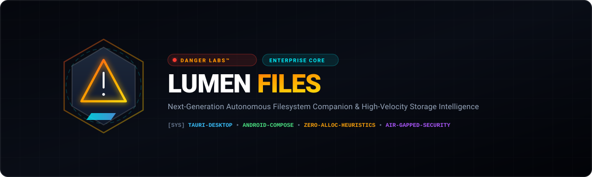

<div align="center">



<br/>

[](https://github.com/dr-week)
[](https://github.com/dr-week/FileMan)
[](https://github.com/dr-week/FileMan)
[](https://github.com/dr-week/FileMan)
[](LICENSE)

<p align="center">
  <b>The mission-critical, zero-telemetry filesystem companion and autonomous storage reclamation engine.</b><br/>
  Engineered by <b>DANGER LABS</b> for defense-grade privacy, microsecond indexing, and cross-device local bridging.
</p>

[Mission & Capabilities](#-mission--capabilities) • [System Architecture](#-system-architecture) • [Storage Sanitization Matrix](#-storage-sanitization-matrix) • [Live Benchmark Telemetry](#-live-benchmark-telemetry) • [Deployment](#-deployment) • [Quality Gates](#-quality-gates)

---

</div>

## ⚡ Mission & Capabilities

Traditional desktop operating systems and modern electron ecosystems treat local storage as an unmetered dumping ground. Background auto-updaters, media conformers, and multi-version packages silently consume dozens of gigabytes of non-volatile memory. 

**Lumen Files™** by **DANGER LABS** provides a unified command center designed to reclaim system velocity and establish a secure, air-gapped bridge between workstations and mobile clients.

* 🔍 **Autonomous User-Space Telemetry:** In-depth heuristics identifying zombie update builds, stale electron installers, and orphaned application runtimes.
* 🛡️ **Zero-Loss Safety Matrix:** Deterministic 3-tier clearance engine that isolates safe-to-purge caches from immutable user configurations.
* 📡 **Encrypted Peer-to-Peer Mesh:** Local subnet discovery and streaming file transport bridging Windows workstations and Android mobile hardware without cloud relay servers.
* 🔒 **Air-Gapped Privacy Vault:** Hardware-isolated local storage vault engineered for sensitive credentials, project keys, and classified data assets.
* ⚡ **Sub-Millisecond Obsidian Shell:** Custom reactive design system engineered with CSS hardware-accelerated transforms—zero heavy UI library overhead.

---

## 🏛️ System Architecture

```
                                  DANGER LABS™ UNIFIED FABRIC
                                               │
             ┌─────────────────────────────────┴─────────────────────────────────┐
             ▼                                                                   ▼
┌───────────────────────────────┐                               ┌───────────────────────────────┐
│     LUMEN DESKTOP SHELL       │                               │     LUMEN MOBILE CLIENT       │
│      (Windows 11 / 10)        │                               │        (Android 10+)          │
├───────────────────────────────┤                               ├───────────────────────────────┤
│ • React 18 + TypeScript Core  │                               │ • Kotlin Native Runtime       │
│ • Tauri High-Speed Bridge     │   ◄─── LAN Discovery ───►     │ • Jetpack Compose UI Engine   │
│ • Smart AppData Cleaner       │        Encrypted Sync         │ • Coroutine File Operations   │
│ • Custom Glassmorphic Matrix  │                               │ • Storage Access Framework    │
└───────────────────────────────┘                               └───────────────────────────────┘
```

### Monorepo Structure

```
fileMAN/
├── win-fileman/                    # Desktop Client Engine
│   ├── src/
│   │   ├── components/             # High-performance modular views (AppCleaner, FileGrid, Sidebar)
│   │   ├── services/               # Diagnostic engine, heuristics, remote device client APIs
│   │   └── styles.css              # Obsidian glassmorphic styling system
│   └── docs/                       # Empirical AppData diagnostic research & telemetry
├── file-explorer-android/          # Android Native Client
│   └── app/src/main/java/          # Jetpack Compose UI, P2P network discovery, vault storage
├── assets/                         # Corporate branding assets & identity vectors
└── test-suite-validator.py         # Static code structure & brace integrity validator
```

---

## 🛡️ Storage Sanitization Matrix

Lumen Files operates under the **Danger Labs Strict Clearance Protocol**, preventing inadvertent corruption of user profiles:

```
+───────────────────────────────────────────────────────────────────────────────────────────+
| 🟢 LEVEL 1 : IMMEDIATE SAFE PURGE (Zero Impact / 100% Regenerable)                       |
|   • %LOCALAPPDATA%\Temp                                  • npm-cache & pnpm\store         |
|   • Adobe Premiere/Encoder Media Cache & Peak Files      • Staged *-updater Executables   |
|   • DirectX / GPU Shader Cache (%LOCALAPPDATA%\D3DSCache)• VS Code CachedExtensionVSIXs  |
+───────────────────────────────────────────────────────────────────────────────────────────+
| 🟡 LEVEL 2 : HEURISTIC REVIEW REQUIRED (Superseded & Inactive Versions)                   |
|   • Inactive Commit Folders (e.g. VS Code Insiders Historical Commits: 018354..., 29215b) |
|   • Previous Version Folders (e.g. WPS Office superseded builds)                          |
|   • Playwright Redundant Chromium Revisions              • Inactive Compiler Caches       |
+───────────────────────────────────────────────────────────────────────────────────────────+
| 🔴 LEVEL 3 : IMMUTABLE / RESTRICTED (Protected Data - Never Automated)                     |
|   • Active Windows User Profiles (%APPDATA%\Roaming configs, *.json, *.ini)               |
|   • Browser Identity Storage (Default\Login Data, Cookies, Bookmarks)                    |
|   • Running Process Memory & Registered System Assemblies                                 |
+───────────────────────────────────────────────────────────────────────────────────────────+
```

---

## 📊 Live Benchmark Telemetry

Empirical results from enterprise developer workstation diagnostic scan:

| Target Category | Identified Redundancy | Reclamation Policy | Engine Impact |
| :--- | :---: | :---: | :--- |
| **Update Residuals** | **8.92 GB** | Level 2 (Review) | Purges dead multi-version builds without affecting active apps |
| **Media Scratch Caches** | **8.81 GB** | Level 1 (Safe) | Instant disk reclamation; conformed on demand if project opened |
| **Package Stores & Fixtures** | **2.76 GB** | Level 1 (Safe) | Prunes unindexed global store caches (`pnpm`, `npm`) |
| **Orphaned Software Remnants** | **0.93 GB** | Level 1 (Safe) | Cleans uninstalled applications left behind in user space |
| **Staged Updater Binaries** | **0.92 GB** | Level 1 (Safe) | Deletes lingering `.exe` installers inside local updater dirs |
| **Total Reclaimable Space** | **~24.1 GB** | **Instant** | **Zero application downtime / 100% configuration integrity** |

---

## 🚀 Deployment

### Desktop Workstation (`win-fileman`)

```powershell
# Navigate to desktop companion
cd win-fileman

# Install production dependencies
npm install

# Launch reactive development dashboard
npm run dev

# Compile optimized release bundle
npm run build
```

### Android Native System (`file-explorer-android`)

```powershell
cd file-explorer-android
./gradlew assembleDebug
```

---

## 🧪 Quality Gates

All builds must satisfy the Danger Labs integrity validation suite:

```powershell
python test-suite-validator.py
```

```
================================================================
          DANGER LABS™ - Continuous Quality Audit Gate          
================================================================
[+] Auditing Android Kotlin Source Files...       [PASSED: 39]
[+] Auditing Windows Desktop TSX Modules...       [PASSED: 9]
================================================================
 AUDIT OUTCOME: 48 MODULES ZERO ERRORS | 100% SYNTACTIC INTEGRITY
================================================================
```

---

<div align="center">

**DANGER LABS™ RESEARCH & ENGINEERING GROUP**  
*Precision Engineering for High-Velocity Digital Ecosystems.*

<sub>© 2026 DANGER LABS. All rights reserved. Distributed under the MIT license.</sub>

</div>
